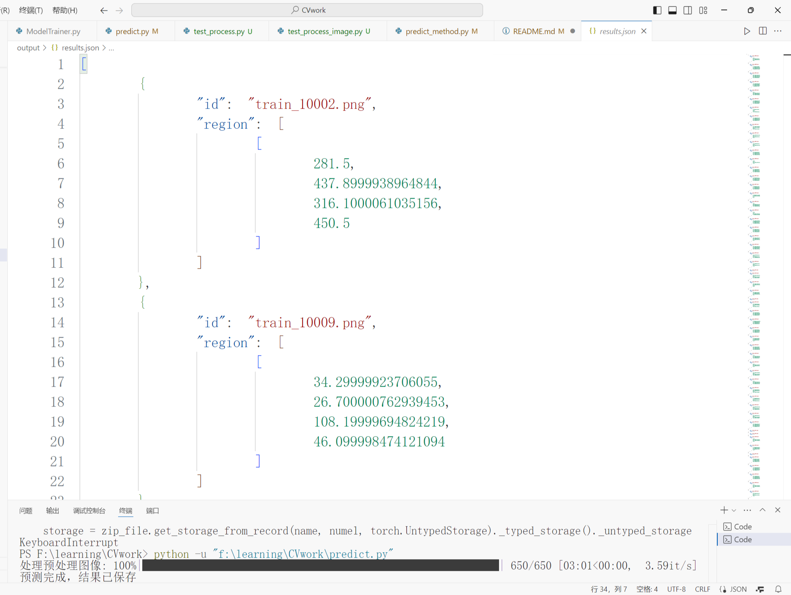

```
- project_root/
    - README.md            # 项目说明文档
    - requirements.txt        # 项目所需库
    - tests/                # 测试代码
        -checkPic.py        # 检查每个标签是否有对应的图像文件
        - ……          # 其他测试代码
    - data/
        - preprocessed_train   # 预处理后的训练数据
        - preprocessed_val   # 预处理后的验证数据
        - train/           # 训练数据
        - validation/         # 验证数据
        - test/            # 测试数据
    - models/
        - faster_rcnn_model.py    # 模型定义或加载脚本
        - ModelTrainer.py        # 模型训练方法
    - utils/
        - data_preprocessing.py   # 数据预处理函数
        - evaluation.py       # 评估函数
        - dataset.py         # 数据集自定义
        - config.py         # 配置参数
        - utils.py         # 辅助函数
        - predict_method.py     # 预测方法
    - output/
        - results.json        # 最终提交的结果文件
    - notebooks/
        - exploration.ipynb      # 数据探索与初步分析
    - train.py               # 训练脚本
    - predict.py               # 预测脚本
    - requirements.txt          # 项目所需库
    - .gitignore            # Git 忽略文件
```
如果你想要模型的话可以直接去huggingface的model hub下载，或者自己训练。
下载地址：https://huggingface.co/NewBridge/CV
把模型放到指定的位置，训练时修改train.py中的目标模型地址就可以了。数据集在原题目中有提供，可以直接使用。
题目地址：https://tianchi.aliyun.com/competition/entrance/532223?spm=a2c22.29524732.0.0.42127baeBUySAL

部分结果展示：



自主训练方式：

```
# anaconda环境
conda create -n cv python=3.9
conda activate cv
pip install -r requirements.txt
```
先运行数据集预处理脚本，自主调整数据集存放
```
python utils/data_preprocessing.py
python train.py
```
训练时会生成日志和模型文件，训练完成后运行预测脚本
```
python predict.py
```

### 任务概述
- **任务目标**：检测图像中被篡改的区域（例如使用了Copy-Move、Splicing或深度学习图像生成技术等）。
- **评价指标**：Micro-F1 score，越高表示越好。具体计算方式结合了**准确率 (Precision)** 和 **召回率 (Recall)**，需要根据检测到的篡改区域与真实标签进行对比，计算TP、FP、FN等。

### 1. 数据集理解
根据任务介绍，数据集分为：
- **训练集**：13,000 张图像
- **验证集**：1,200 张图像
- **测试集**：5,000 张图像

这些数据包含不同类型的图像（如文档、票据、街景等），每张图像可能含有不同方式的篡改（例如：剪切、拼接、删除、或深度伪造）。你需要根据这些图像的篡改特征设计你的模型。

### 2. 环境搭建与工具准备
在开始建模之前，确保你的开发环境已经准备好。推荐使用以下工具和库：
- **Python**：Python 3.9+。
- **PyTorch / TensorFlow**：用于深度学习模型的构建。
- **OpenCV**：用于图像处理。
- **Matplotlib**、**PIL**：用于图像可视化和预处理。
- **scikit-learn**：用于评估指标计算。

### 3. 数据预处理与特征工程
图像预处理对模型的效果影响很大，以下是一些常见的预处理步骤：
- **数据增强**：为了提升模型的鲁棒性，可以对训练数据进行增强（如旋转、翻转、缩放、裁剪等）。
- **图像归一化**：将图像的像素值归一化到[0, 1]区间。
- **灰度化和色彩处理**：可以根据任务的需要，将图像转换为灰度图或处理颜色通道。

### 4. 选择模型
根据比赛要求，你可以选择不同的模型，最常见的选择包括：
1. **基于检测的模型**：
   - **Faster R-CNN**：一种常用的目标检测模型，适用于区域检测任务。可以在其基础上进行微调，识别篡改区域。
   - **YOLO系列**：也适合目标检测，尤其是对于实时性要求较高的场景。
   - **RetinaNet**：同样适用于检测任务，特别是对小物体的检测。

2. **基于大模型的方案**：
   - **SAM (Segment Anything Model)**：Segment Anything 是 Meta 提出的一个可以进行任意物体分割的模型，如果任务需要处理一些复杂的场景，可以考虑使用这种方法。

3. **多模型协同**：
   - 可以考虑将多个检测模型结合起来（例如：Faster R-CNN + SAM），通过集成学习方法（如加权平均、投票等）进一步提升检测效果。

### 5. 训练模型
在训练过程中，要注意以下几点：
- **训练集和验证集**：使用训练集训练模型，使用验证集进行调参和评估。
- **损失函数**：常见的损失函数包括交叉熵损失、Focal Loss（对于不平衡数据集非常有效）。
- **优化器**：可以选择 Adam、SGD 等优化器，学习率的设置非常关键。
- **过拟合处理**：如果训练集上过拟合，考虑加入 dropout、正则化等方法。

### 6. 模型评估与调优
在模型训练完成后，需要对验证集进行评估。你需要计算**Micro-F1 score**，并通过调参来优化模型。调优策略包括：
- 调整模型的超参数（如学习率、批次大小等）。
- 调整模型架构（例如层数、过滤器大小等）。
- 尝试不同的模型融合策略（例如：集成多个模型）。

### 7. 预测与结果提交
- **预测**：在测试集上进行预测，返回每张图像被篡改区域的坐标框。
- **结果格式**：按照要求，输出一个 JSON 格式的文件，每行一个图像的 ID 和对应的篡改区域（region）。如果没有篡改，region 数组为空。

例如，输出格式应为：
```json
[
    {"id": "ab32sasdf23.jpg", "region": [[596.0,123.0,620.0,138.0], [120.0,332.0,987.0,456.0]]},
    {"id": "1461a53efad09dfa.jpg", "region": [[12.0,35.0,34.0,56.0]]},
    {"id": "a3087a0b0e05.jpg", "region": []}
]
```

### 8. 提交与代码审核
根据比赛要求，你需要提交完整的代码，包括数据预处理、特征工程、模型训练和预测等步骤，并确保代码中有充分的注释，方便审核。

### 总结
- 任务的核心是**检测篡改区域**，因此选择合适的图像检测方法（如Faster R-CNN等）非常重要。
- 需要保证训练数据的充分利用，同时避免在测试数据上过拟合。
- 微调模型、优化参数，并使用验证集评估模型的表现。
- 最后，生成符合要求的输出结果，并提交代码。

### 下一步建议
1. **了解并下载数据集**：熟悉数据集的结构和特点。
2. **选择合适的模型框架**：决定是否使用Faster R-CNN或其他方法。
3. **开始预处理和训练**：先从数据预处理和简单模型训练开始，逐步优化。

### **参数表**
训练参数表如下：
| 参数名              | 类型        | 默认值           | 描述                                                                                     |
|-------------------|-----------|---------------|----------------------------------------------------------------------------------------|
| `train_image_dir` | `str`     | 无（必填）        | 训练图像文件夹路径，包含预处理后的 `.pt` 文件和掩膜（如 `_mask.png` 文件）。                            |
| `val_image_dir`   | `str`     | 无（必填）        | 验证图像文件夹路径，同样包含 `.pt` 文件和掩膜。                                                     |
| `train_label_path`| `str`     | 无（必填）        | 存储训练数据标签的 JSON 文件路径。                                                                |
| `val_label_path`  | `str`     | 无（必填）        | 存储验证数据标签的 JSON 文件路径。                                                                |
| `num_classes`     | `int`     | 2             | 类别数量（包含背景类）。通常设为 `2`，即背景类和篡改区域。                                               |
| `batch_size`      | `int`     | 4             | 每次训练的批次大小。根据 GPU 显存大小选择合适值，默认为 4。                                                |
| `num_epochs`      | `int`     | 10            | 训练的总轮数。                                                                                  |
| `learning_rate`   | `float`   | 0.005         | 优化器学习率，用于控制梯度下降步长。                                                               |
| `momentum`        | `float`   | 0.9           | SGD 优化器的动量参数，用于加速梯度下降。                                                            |
| `weight_decay`    | `float`   | 0.0005        | SGD 优化器的权重衰减参数，用于防止过拟合。                                                          |
| `save_dir`        | `str`     | `"models/checkpoints/"` | 模型保存路径

训练参数表
| 参数名                 | 类型        | 默认值                            | 描述                                                                                     |
|----------------------|-----------|--------------------------------|----------------------------------------------------------------------------------------|
| `confidence_threshold` | `float`   | `0.5`                          | 预测置信度阈值，表示当模型预测的置信度高于此值时，将该结果视为有效预测。                                                     |
| `device`               | `str`     | `'cuda'` 或 `'cpu'`            | 指定用于模型计算的设备，自动选择 GPU (`'cuda'`) 或 CPU (`'cpu'`) 取决于是否有可用的 GPU。                                      |
| `batch_size`           | `int`     | `1`                            | 每次进行推理时的批次大小。通常值越大，推理速度越快，但受到设备内存的限制。                                                     |
| `normalize_mean`       | `list`    | `[0.485, 0.456, 0.406, 0.0]`   | 图像归一化过程中各通道的均值。这个参数用于将图像的 RGB（或 RGBA）通道标准化，帮助模型在输入上实现更一致的统计特性。                          |
| `normalize_std`        | `list`    | `[0.229, 0.224, 0.225, 1.0]`   | 图像归一化过程中各通道的标准差。归一化操作的标准差参数用于缩放每个通道的数值，使其更符合标准的分布。第四个值为 `1.0`，用于可能存在的透明度通道。          |
| `model_path`           | `str`     | `"output/model_final.pth"`     | 预训练模型的文件路径，用于加载模型权重，进行预测。                                                                  |
| `input_path`           | `str`     | 无（必填）                        | 输入图像文件路径，表示需要进行预测的图像文件的位置。                                                               |
| `output_path`          | `str`     | `"output/results.json"`        | 预测结果保存路径，存储预测的结果信息，例如检测出的篡改区域、坐标等。                                                   |
| `save_visualization`   | `bool`    | `True`                         | 是否保存预测的可视化结果。                                                                                     |